# Procesverslag
**Auteur:** Lalla Bah

## Bronnenlijst
1.  https://dev.to/ljcdev/easy-hamburger-menu-with-js-2do0 Heb ik gebruikt bij het ontwerpen van een hamburger menu
2.  https://www.youtube.com/watch?v=o0YiZF9XZL0 Als voorbeeld bij dropdown
3.  https://codepen.io/storyofedd-the-decoder/pen/MLrjjL?editors=1100 Als voorbeeld bij dropdown
4. https://developer.mozilla.org/en-US/docs/Web/HTML/Element/select

## Eindgesprek (week 7/8)

De website is zo goed als af. Met behulp van een hele fijne youtube video, terugkijken in de slides van de werkgroepen en mijn eigen kennis ben ik nu tevreden met het eindresultaat. Wat ik erg lastig vond, was het creeeren van een hamburger menu en een dropdown. Programmeren met JavaScript is niet mijn grootste vaardigheid, maar het is uiteindelijk gelukt om een uitklapbaar menu te ontwerpen met js. De kleuren matchen nu goed en ik heb er voor gezorgd dat het voor alle mobiele apparaten responsive is. In het begin vond ik dit erg lastig, dus ik merk nu dat ik daarin ben gegroeid. Hieronder plaats ik de screenshots van het eindproduct.

Eerst kwam ik niet er niet goed uit hoe ik dingen naast elkaar kon plaatsen of dingen neer kon zeten zonder "br" te gebruiken. Gelukkig is dat nu wel gelukt. Ook had ik moeite met de tekst onder de grote plaatjes. Op een of andere manier sprong dit in. Nu is het gelukt om dit netjes af te werken. 

Daarbij moet ik zeggen dat de officiele site van fit for free nu helaas is aangepast vanwege covid. Daarom heb ik een aantal dingen zelf bedacht. 

**Screenshot(s):**

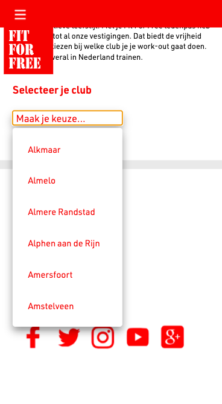
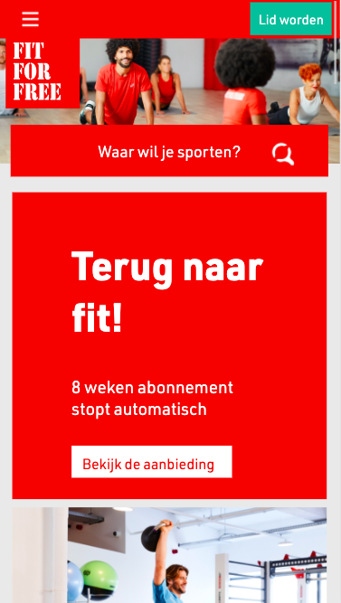
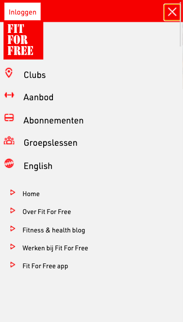
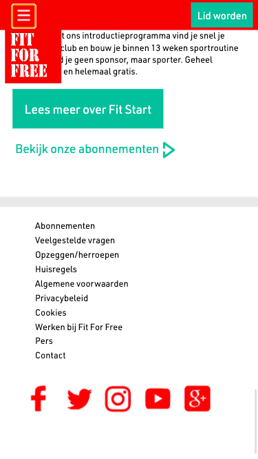

## Voortgang 3 (week 6)

https://codepen.io/shooft/pen/jOMOroZ NAV wil ik nog bekijken
Ik heb ervoor gezorgd dat er maar 1 H1 is per pagina. En om de br eruit te halen heb ik de width bij h1 op 300px gezet. Hierdoor komt het automatisch onder elkaar te staan.

Ik heb de padding en margin met left en right 2vw aangepast naar em de witte knop met de afbeelding verandererd waardoor pijltje er altijd naast komt te staan, ongeacht de breedte.

Verder heb ik besloten om het drop down menu en hamburger menu compleet over nieuw te doen zodat ik het zelf volledig begrijp en niet het gevoel heb dat ik het van iemand heb overgenomen. 

## Aantekeningen feedback
- Border op alles
- Nav van Sanne
- https://codepen.io/shooft/pen/jOMOroZ NAV
- Maar 1 H1 per pagina —
- Width bij h1 op 300px zetten komt het automatisch onder elkaar —
- Section padding, text en afbeelding naar binnen, overal padding/margin vanaf
- Width veranderen naar 100% van de img
- Witte knop display block, padding weghalen
- Margin top em 


**Screenshot(s):**
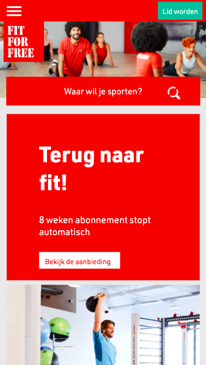
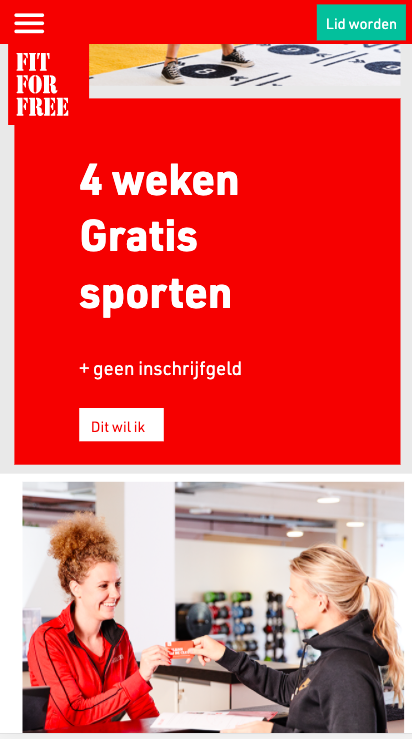
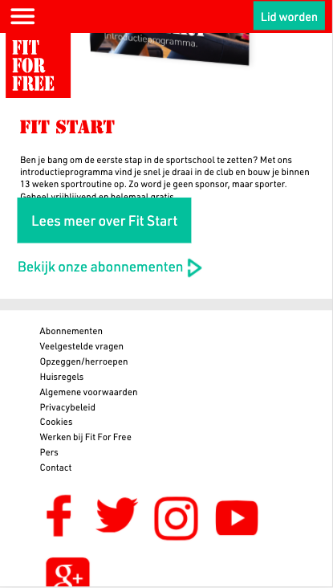

## Voortgang 2 (week 5)

Het is me eindelijk gelukt om de verschillende lettertypes toe te voegen, zorgen dat alles goed onder elkaar komt zonder 90em te gebruiken en het responsive te maken voor verschillende mobiele devices.

Ik ben best tevrede over de voortgang. Nog lang niet waar ik wil zijn, maar er zit zeker progressie in en dat is wel motiverend. Ik hoop dat ik bij het volgende voortgangsgesprek de buttons wat meer kan aan passen en dat ik het meer op mijn eigen manier kan doen. Ook hoop ik dat ik dan javascript kan toepassen voor kleine animaties van de knoppen.

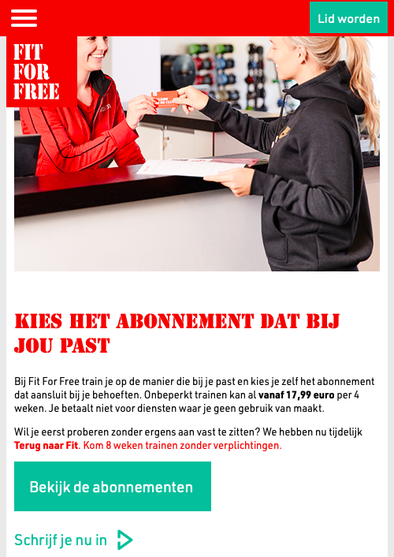

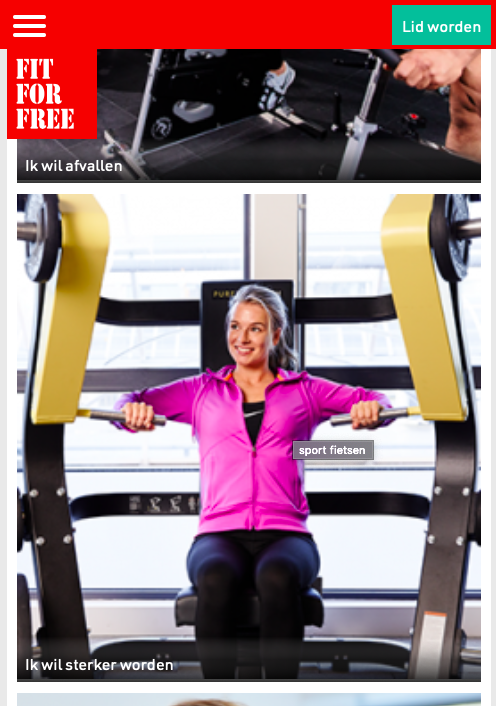
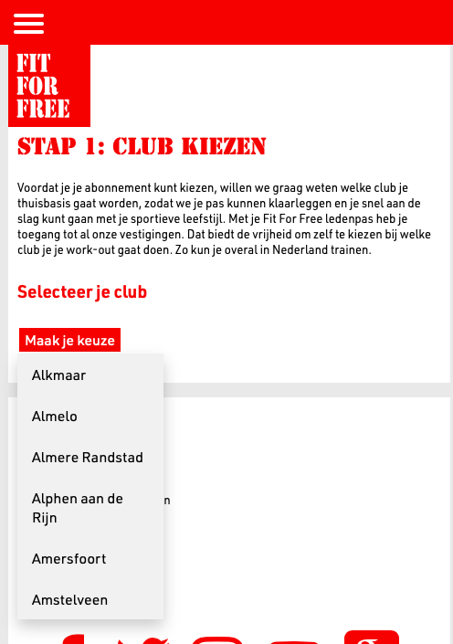

## Voortgang 1 (week 3)

### Stand van zaken

Het is me eigenlijk nog niet zo goed gelukt om de juiste font toe te voegen terwijl dit andere keren wel is gelukt. Daarnaast is hij nu alleen nog werkend voor 1 type telefoon. Ik wil hem responsive hebben voor welke telefoon dan ook. Dit is niet helemaal goed gegaan. Ik hoop dat ik dit komende weken kan verbeteren door meer te oefenen. 

Hij is nu "passend" voor een iphone 6/7/8 plus.

**Screenshot(s):**

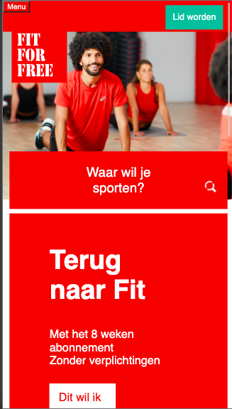
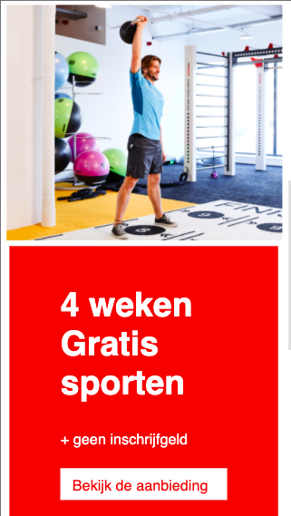

### Agenda voor meeting

Meeting: 8 januari 10:15 eindbeoordeling

### Verslag van meeting

- Alle absoluut weghalen
- Netjes onder elkaar

## Intake (week 1)

**Je startniveau:** blauwe piste

**Je focus:** Surface plane 

**Je opdracht:** www.fitforfree.nl

**Screenshot(s):**

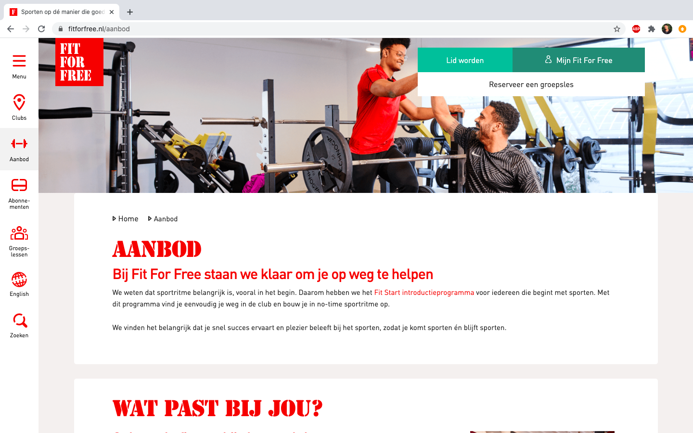

**Breakdown-schets(en):**

